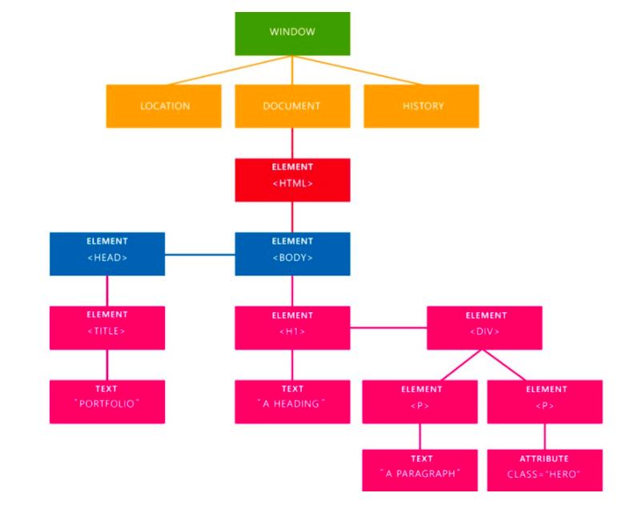

# Javascript I

### O objetivo desse módulo é apresentar às alunas conceitos básicos de javascript, tais como variáveis, condicionais, loops, objetos, funções e manipulação do DOM.


***

* [Primeira aula](#primeira-aula)
  * [Introdução](#introducao)
    - [Princípios básicos](#principios-basicos)
    - [O que é lógica](#o-que-e-logica)
    - [Exercício de lógica](#exercicio-de-logica)
    - [O que são algoritmos](#o-que-sao-algoritmos)
    - [Exercício de algoritmos](#exercicio-de-algoritmos)
  * [Variáveis](#variáveis)
  * [Comentários](#comentários)
  * [Operadores aritméticos](#operadores-aritméticos)
  * [Operadores de atribuição](#operadores-de-atribuição)
  * [Operadores de comparação](#operadores-de-comparação)
  * [Operadores lógicos](#operadores-lógicos)
  * [Data types](#data-types)
  * [Palavras reservadas](#palavras-reservadas)
  * [Case sensitive](#case-sensitive)
  * [Nomenclatura](#nomenclatura)
  * [Chamando o JS dentro do HTML](#chamando-o-js-dentro-do-html)
  * [Manipulação do DOM](#manipulação-do-dom)
    - [DOM](#dom)
    - [getElementById()](#getelementbyid)
    - [querySelector()](#queryselector)
    - [addEventListener()](#addeventlistener)
      - [DOMContentLoaded](#domcontentloaded)
      - [click](#click)
      - [mouseover](#mouseover)
      - [change](#change)
    - [innerHTML](#innerHTML)
  * [console.log() e alert()](#consolelog-e-alert)
  * [Concatenação de variáveis](#concatenação-de-variáveis)
  * [if/else if/else](#ifelse-ifelse)
  * [Exercícios](exercícios)


### Primeira aula

#### Variáveis
No computador, uma variável é um espaço de memória que vai ser preenchido por algum valor variável. Na maioria dos casos, o valor variável vai ser definido pelo usuário.

Exemplo: Você faz o cadastro em um site, preenchendo um formulário com seu {nome} e depois quando você está logado na página você visualiza seu nome na página.


***

Para declarar uma variável, podemos utilizar a palavra reservada `var`, seguida do nome da variável e o valor que estamos atribuindo a ela.

```js
var meuNome = 'Patricia';
```

Nas nossas aulas vamos utilizar duas palavras reservadas para declarar variáveis: `let` e `const`.

`let` é a versão mais moderna de `var`. A sintaxe é mesma.

```js
let fruta = 'Pera';
fruta = 'Abacaxi';
```

`const` é um novo jeito de declarar uma variável. A diferença é que ela é uma variável cujo valor, após ser declarado, não pode ser alterado.

```js
const meuNome = 'Patricia';
meuNome = 'Maria';

//A atribuição acima não é possível, e vai retornar um erro.
```

Referência: https://www.w3schools.com/js/js_es6.asp


#### Comentários
Comentar o código serve para deixar mensagens importantes para você e para outro programador que vai ler seu código.

Em JavaScript você pode fazer comentários de duas formas:

- Comentário em uma linha

```js
// Comentário simples de uma linha
```

- Comentário de múltiplas linhas

```js
/* Comentário
 de múltiplas
 linhas */
```

#### Operadores aritméticos

- Soma `+`
- Subtração `-`
- Multiplicação `*`
- Divisão `/`
- Exponenciação `**`
- Módulo (resto da divisão) `%`
- Incremento `++`
- Decremento `--`


#### Operadores de atribuição

- Igual `=`
- Adiciona valor `+=`
- Subtrai valor `-=`
- Multiplica valor `*=`
- Divide valor `/=`


#### Operadores de comparação

- Igual a `==` `===` (mesmo valor e mesmo tipo)
- Não é igual a `!=` `!==` (mesmo valor e mesmo tipo)
- Maior que `>`
- Menor que `<`
- Maior ou igual que `>=`
- Menor ou igual que `<=`
- Operador ternário `?`

``` js
(condição) ? resultado verdadeiro : resultado falso

let idade = 26;
let bebida = (age >= 21) ? "Cerveja" : "Suco";
console.log(bebida); // Cerveja
```

#### Operadores lógicos
- E `&&`
- Ou `||`
- Não/negação `!`
-

#### Data types

Tipos de dados (data types) são conceitos muito importantes em qualquer linguagem de programação.
Para conseguirmos trabalhar com variáveis, precisamos saber com que tipo de dado estamos lidando.

Existem alguns tipos de variáveis em Javascript:

* String
```js
let nome = 'Patricia';
```

* Number
```js
let number = 10;
```

* Boolean
```js
let option = false;
```

* Function
```js
let varFunction = function() {
  //código da função
}
```

* Array
```js
let sanduiches = ['Presunto e queijo', 'Mortadela', 'Rosbife'];
```

* Object
```js
let sanduiche = {
    nome: "Mortadela",
    preco: "5",
    disponibilidade: true
};
```

* Undefined
```js
let nome;
```

* Empty
```js
let nome = "";
```

* Null
 ```js
let nome = null;
```


#### typeof

`typeof` serve para descobrirmos o tipo de variável que estamos declarando ou recebendo. Importante lembrar que `typeof` retorna o tipo e não o valor da variável.

```js
typeof 0  //retorna number
typeof 'Patricia'  //retorna string
```

#### isNaN()

`isNaN()` é uma função nativa do Javascript que serve para descobrir se uma variável NÃO é um número. Função nativa é uma função que já está pronta para ser usada quando quisermos, ela já vem junto com a linguagem.

```js
isNaN(1) //retorna false, porque é um número
```

```js
isNaN('patricia') //retorna true, porque não é um número
```


#### Palavras reservadas

Existem algumas palavras que não podemos utilizar para declarar variáveis, pois elas fazem parte da linguagem javascript.

```js
let let = 'nome da variável';
```


#### Case sensitive
Palavras que começam com letra maiúscula e minúscula são consideradas diferentes pelo JavaScript.

```js
let primeiroNome = 'Patricia';
let primeironome = 'Fernanda';
```

#### Nomenclatura

É importante seguir um padrão para nomemclatura de nomes de variáveis.
Existem 3 padrões de nomemclatura:

- underscore, com todas as letras minúsculas

```js
let primeiro_nome = 'Patricia';
```

- upper camelcase, todas inicias maiúsculas

```js
let PrimeiroNome = 'Patricia';
```

- lower camelcase, primeira letra minúscula e todas as inicias das próximas palavras maiúsculas

```js
let primeiroNome = 'Patricia';
```

```
Importante:
Não utilizar hífen, nem espaços e nem caracteres especiais para separar nomes de variáveis.
```

***

### Chamando o JS dentro do HTML

```html
<!DOCTYPE html>
<html>
  <head>
    <link rel="stylesheet" href="css/style.css">
    <script src="js/script.js"></script>
  </head>
  <body>
    <h1>Título</h1>
    <p>Parágrafo</p>
  </body>
</html>
```

***

### Manipulação do DOM

#### DOM

DOM = Document Object Model

O DOM é uma interface que representa como os documentos HTML e XML são lidos pelo seu browser. Após o browser ler seu documento HTML, ele cria um objeto que faz uma representação estruturada do seu documento e define meios de como essa estrutura pode ser acessada. Nós podemos acessar e manipular o DOM com JavaScript.




#### getElementById()

Esse método retorna o elemento que estiver contendo o nome do ID passado. Como os IDs devem ser únicos, é um método muito útil para pegar apenas o elemento desejado.

```html
<div>
  <input type="text" id="textInput" class="text-input"  />
</div>
```

```js
let getInputId = document.getElementById('textInput');
```

#### querySelector()

Esse método retorna qualquer elemento do DOM, como classes, tags e ID's. Você precisa deixar explicito se está chamando uma classe, um ID ou uma tag.

```html
<div>
  <input type="text" id="textInput" class="text-input" />
</div>
```

```js
let getInputId = document.querySelector('#textInput');
let getInputClass = document.querySelector('.text-input');
let getInputTag = document.querySelector('input');
```

```
Importante:
Vamos utilizar sempre os seletores de ID. No HTML as classes vão ser utilizadas para estilizar o CSS, e o ID vai ser utilizado para manipular o DOM pelo Javascript.
```

#### addEventListener()
Os elementos DOM além de possuirem métodos também possuem eventos. São eles que fazem a interatividades dos elementos no documento.


##### DOMContentLoaded

O código HTML é lido de cima para baixo. No header do HTML nós chamamos nosso arquivo de .js, e ele é lido e executado imediatamente, antes mesmo do HTML ser carregado.
Para evitar isso, nós vamos sempre colocar nossos códigos js dentro da função abaixo:

```js
window.addEventListener('DOMContentLoaded', function() {
  // aqui vai todo o código a ser executado na página
});
```

Ela vai fazer com que o browser leia nosso arquivo .js mas espero o DOM terminar de carregar para executar os códigos que estão dentro do nosso arquivo.


##### click

```html
<div>
  <button id="button" />
</div>
```

```js
let getButtonId = document.querySelector('#button');

getButtonId.addEventListener('click', function() {
    // quando o botão for clicado esse código será executado
  });
```

##### mouseover

```html
<div>
  <button id="button" />
</div>
```

```js
let getButtonId = document.querySelector('#button');

getButtonId.addEventListener('mouseover', function() {
    // quando o mouse passar por cima do botão esse código será executado
  });
```

##### change

```html
<select id="select">
  <option value="option1">Opção 1</option>
  <option value="option2">Opção 2</option>
</select>
```

```js
let getSelectId = document.querySelector('#select');

getSelectId.addEventListener('change', function() {
    // quando o element for modificado esse código será executado
  });
```

#### innerHTML

```html
  <div id="displayText"></div>
```

```js
let displayText = document.querySelector('#displayText');
displayText.innerHTML = "Texto que eu inseri no HTML."

```


#### console.log() e alert()

```js
let getInputId = document.getElementById('textInput');
console.log(getInputId)
```

```js
let getInputId = document.getElementById('textInput');
alert(getInputId)
```

#### Concatenação de variáveis

```js
let name = 'Patricia';
console.log(`Meu nome é ${name}`);
```

```js
let name = 'Patricia';
console.log("Meu nome é " + name);
```


#### if/else if/else

If/else if/else são condicionais que utilizamos para executar ou não um pedaço de código.
Na vida real seria como tomar a decisão de atravessar ou não a rua. SE o sinal estiver VERDE, você atravessa. SENÃO (vermelho), você espera.


```js
if (condição) {
  // se a condição for verdadeira, o código aqui dentro será executado
}
```

```js
if (condição) {
  // se a condição for verdadeira, o código aqui dentro será executado
} else {
  // se a primeira condição não for verdadeira, o código aqui dentro será executado
}
```

```js
if (condição) {
  // se a condição for verdadeira, o código aqui dentro será executado
} else if (condição) {
  // se a condição anterior não for verdadeira, o código aqui dentro será executado
} else {
  // se a condição anterior não for verdadeira, o código aqui dentro será executado
}
```

O else if pode ser repetido quantas vezes for necessário.


#### Exercícios

https://github.com/reprograma/T7-javascript-I/blob/master/Exercicios-primeira-aula/exercicios.md

***
