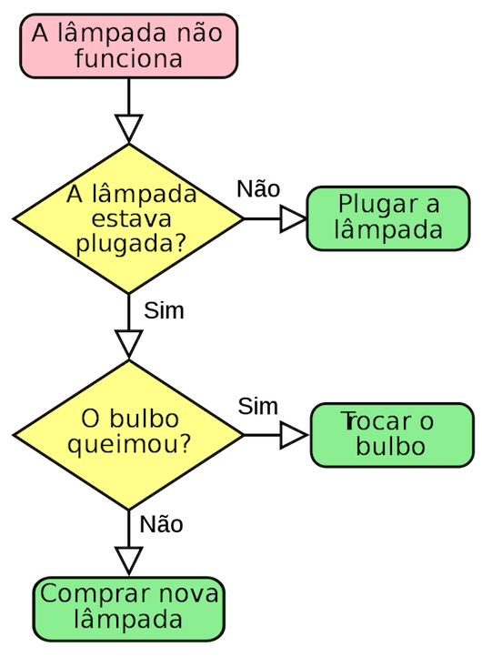
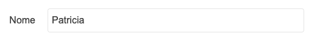
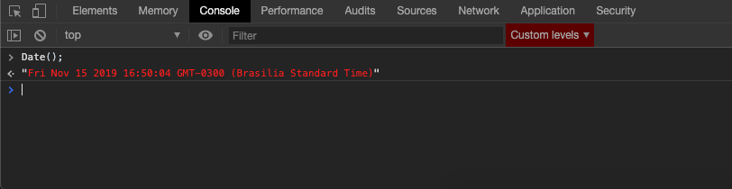

# Lógica + Javascript

### O objetivo desse módulo é apresentar às alunas conceitos básicos de lógica, lógica de programação, algoritmos e introdução ao javascript, com conceitos como variáveis, operadores e condicionais.


***
* [Dúvidas sobre o conteúdo](#dúvidas-sobre-o-conteúdo)
* [Lógica e algoritmos](#lógica-e-algoritmos)
  * [O que é lógica](#o-que-é-lógica)
  * [Exercício de lógica](#exercício-de-lógica)
  * [O que é lógica de programação](#o-que-é-lógica-de-programação)
  * [O que são algoritmos](#o-que-são-algoritmos)
  * [Como criar algoritmos](#como-criar-algoritmos)
  * [Exercícios de algoritmos](#exercícios-de-algoritmos)
* [Javascript](#javascript)
  * [Linguagem de programação](#linguagem-de-programação)
  * [O que é Javascript](#o-que-é-javascript)
  * [Variáveis](#variáveis)
  * [Palavras reservadas](#palavras-reservadas)
  * [Comentários](#comentários)
  * [Calculando com javascript - Operadores aritméticos](#calculando-com-javascript---operadores-aritméticos)
  * [Atribuindo valores com javascript - Operadores de atribuição](#atribuindo-valores-com-javascript---operadores-de-atribuição)
  * [Comparando valores com javascript - Operadores de comparação](#comparando-valores-com-javascript---operadores-de-comparação)
  * [Verificando lógica com javascript - Operadores lógicos](#verificando-lógica-com-javascript---operadores-lógicos)
  * [Data types (Tipos de dados)](#data-types-tipos-de-dados)
  * [typeof](#typeof)
  * [Funções nativas](#funções-nativas)
  * [Case sensitive](#case-sensitive)
  * [Nomenclatura](#nomenclatura)
  * [Concatenação de variáveis](#concatenação-de-variáveis)
  * [Ferramentas para testar o código](#ferramentas-para-testar-o-código)
  * [console.log(), alert(), confirm e prompt](#consolelog-alert-confirm-e-prompt)
  * [Exercícios de console.log(), alert(), confirm e prompt](exercícios-de-consolelog-alert-confirm-e-prompt)
  * [if/else if/else (condicionais)](#ifelse-ifelse-condicionais)
  * [Exercícios](#exercicios)
  * [Tarefa de casa](https://github.com/reprograma/On3-logica-com-js/blob/master/exercicios/exercicio-tarefa-de-casa.md)


### Dúvidas sobre o conteúdo

https://github.com/reprograma/On3-logica-com-js/issues

http://dontpad.com/On3-logica-com-js

***

## Lógica e algoritmos

#### O que é lógica

Lógica tem dois significados principais: discute o uso de raciocínio em alguma atividade e é o estudo do raciocínio válido. No segundo sentido, a lógica é discutida principalmente nas disciplinas de filosofia, matemática e ciência da computação.
(Fonte: [Wikipedia](https://pt.wikipedia.org/wiki/Lógica))

Abaixo temos um paradoxo (declaração aparentemente verdadeira que leva a uma contradição lógica) de lógica:

```
A afirmação abaixo é verdadeira.
A afirmação acima é falsa.
```

- Exemplos de lógica no dia a dia?

#### Exercício de lógica

https://github.com/reprograma/On3-logica-com-js/blob/master/exercicios/exercicio-1.md


#### O que é lógica de programação
O que podemos notar no exercício que fizemos acima?
Podemos dizer que seguimos uma sequência ordenada de passos até conseguir no resultado final? (Lemos cada frase, preenchemos valores em cada campo, eliminamos valores já preenchidos).

Lógica de programação é o método usado para escrever programas que um computador entenda.

A lógica de programação parte do princípio de que praticamente todas as tarefas humanas são uma sequência ordenada de passos, que acontecem durante um tempo finito e que produzem um resultado esperado.

Na ciência da computação, a álgebra booleana é a base do projeto de hardware, e é um conceito muito utilizado na programação.

```
0 e 1
não e sim
falso e verdadeiro
```


#### O que são algoritmos
Ao falar de lógica de programação nós já descrevemos o que é um algoritmo.

Algoritmo é um conceito muito antigo, que é utilizado desde antes de Cristo. Para os antigos, o algoritmos são procedimentos precisos, não ambíguos, mecânicos, eficientes e corretos.

Algumas definições de um algoritmo na programação são:

```
- Sequência ordenada de passos, que acontecem durante um tempo finito e que produzem um resultado esperado.

- Conjunto das regras e procedimentos lógicos perfeitamente definidos que levam à solução de um problema em um número finito de etapas.

- Uma receita que mostra passo a passo os procedimentos necessários para a resolução de uma tarefa.
```


#### Como criar algoritmos

Os algoritmos surgem com a necessidade de resolver algum problema ou executar uma tarefa.
Para ajudar, podemos utilizar um fluxograma, que vai dar apoio visual para resolvermos a tarefa.

#### Fluxograma para resolver um problema de lâmpada que não acende


#### Fluxograma para assar um pão


Após a criação do fluxograma podemos começar a escrever o algoritmo

```
// Algoritmo para assar um pão
- Abrir o forno
- Verificar se o forno está ligado
- Colocar lenha ou acender o fogo
- Assar o pão
```

#### Exercícios de algoritmos

https://github.com/reprograma/On3-logica-com-js/blob/master/exercicios/exercicio-2.md


## Javascript

#### Linguagem de programação

A linguagem de programação é um método padronizado para comunicar instruções para um computador. É um conjunto de regras sintáticas e semânticas usadas para definir um programa de computador. É uma linguagem que pode ser compreendida tanto por um ser humano como por um computador.

A linguagem de programação pode ser comparada às linguas faladas pelos seres humanos. A língua portuguesa, por exemplo, tem um conjunto de regras de sintaxe e de semântica, que uma pessoa precisa aprender para se comunicar com outra.
No caso do computador, ele só entende comandos lógicos. Por exemplo ele não sabe o que é um pão, para ele pão é uma palavra que ele trata como texto.

Existem diversos tipos de linguagem de programação, e elas podem ser classificadas em vários tipos. Um dos tipos de classificação é por nível de abstração, que pode ser baixo ou alto.
As linguagens de baixo nível normalmente estão relacionadas a tarefas que acontecem na arquitetura do computador. As de alto nível as vezes precisam de um compilador (um programa intermediário que traduz o que o ser humano escreveu para uma linguagem que a máquina entenda), como Java e C.


#### O que é Javascript

JavaScript é uma linguagem de programação interpretada (não precisa de um compilador, ela é lida diretamente pelo navegador) estruturada (ênfase em sequência, decisão e, iteração - subrotinas, laços de repetição, condicionais e, estruturas em bloco), client-side, de script em alto nível .Juntamente com HTML e CSS, o JavaScript é uma das três principais tecnologias da Internet. JavaScript surgiu em 1995 e permite páginas da Web interativas e, portanto, é uma parte essencial dos aplicativos da web. A grande maioria dos sites usa, e todos os principais navegadores têm um mecanismo JavaScript dedicado para executá-lo.

Javascript também é chamado de JS. Javascript e Java são linguagens completamente diferentes.

Os arquivos Javascript possuem a extensão `.js`.

Para programar e testar em javascript precisamos somente de um editor de código e um navegador.


#### Variáveis
No computador, uma variável é um espaço de memória que vai ser preenchido por algum valor variável. Na maioria dos casos, o valor variável vai ser definido pelo usuário.

Exemplo: Você faz o cadastro em um site, preenchendo um formulário com seu {nome} e depois quando você está logado na página você visualiza seu nome na página.





- Quais seriam as variáveis do algoritmo que vocês escreveram no exercício de cálculo da média?

***

Para declarar uma variável, podemos utilizar a palavra reservada `var`, seguida do nome da variável e o valor que estamos atribuindo a ela.

```js
var meuNome = 'Patricia';
var fruta = 'Pera';
```

Nas nossas aulas vamos utilizar a palavras reservada `let` para declarar variáveis.

`let` é a versão mais moderna de `var`. A sintaxe é mesma.

```js
let meuNome = 'Patricia';
let fruta = 'Pera';
```

Referência: https://www.w3schools.com/js/js_es6.asp


#### Palavras reservadas

Existem algumas palavras que não podemos utilizar para declarar variáveis, pois elas fazem parte da linguagem javascript.

```js
let let = 'nome da variável';
// retorna um erro, pois estamos tentando declarar uma variável com um nome reservado
```

Lista de palavras reservadas em Javascript: https://www.w3schools.com/js/js_reserved.asp


#### Comentários
Comentar o código serve para deixar mensagens importantes para você e para outro programador que vai ler seu código.

Em JavaScript você pode fazer comentários de duas formas:

- Comentário em uma linha

```js
// Comentário simples de uma linha
```

- Comentário de múltiplas linhas

```js
/* Comentário
 de múltiplas
 linhas */
```

#### Calculando com javascript - Operadores aritméticos

Podemos fazer cálculos matemáticos com javascript, e para isso utilizamos operadores aritméticos - os mesmos que estudamos na escola (soma, subtração, multiplicação, divisão)

- Soma `+`
- Subtração `-`
- Multiplicação `*`
- Divisão `/`
- Exponenciação `**`
- Módulo (resto da divisão) `%`
- Incremento `++`
- Decremento `--`


#### Atribuindo valores com javascript - Operadores de atribuição

Para atribuir valores à variáveis utilizamos operadores de atribuição.

- Igual `=` `x = y`
- Adiciona valor `+=` `x = x + y`
- Subtrai valor `-=` `x = x - y`
- Multiplica valor `*=` `x = x * y`
- Divide valor `/=` `x = x / y`


#### Comparando valores com javascript - Operadores de comparação

Para comparar valores à variáveis utilizamos operadores de comparação.

- Igual a `==` `===` (mesmo valor e mesmo tipo)
- Não é igual a `!=` `!==` (mesmo valor e mesmo tipo)
- Maior que `>`
- Menor que `<`
- Maior ou igual que `>=`
- Menor ou igual que `<=`
- Operador ternário `?`

``` js
(condição) ? resultado verdadeiro : resultado falso

let idade = 26;
let bebida = (idade >= 21) ? "Cerveja" : "Suco";
console.log(bebida); // Cerveja
```

#### Verificando lógica com javascript - Operadores lógicos
- E `&&`
- Ou `||`
- Não/negação `!`


Referência: https://developer.mozilla.org/en-US/docs/Web/JavaScript/Guide/Expressions_and_Operators


#### Data types (Tipos de dados)

Tipos de dados (data types) são conceitos muito importantes em qualquer linguagem de programação.
Para conseguirmos trabalhar com variáveis, precisamos saber com que tipo de dado estamos lidando.

Existem alguns tipos de variáveis em javascript:

* String
É uma variável que representa texto, e seu valor é apresentado usando aspas.

```js
let nome = 'Patricia';
```

* Number
É uma variável que representa um número, e seu valor é apresentado usando sem aspas.

```js
let number = 10;
```

* Boolean
É uma variável lógica que representa dois valores: verdadeiro ou falso. Seu valor é apresentado usando sem aspas.

```js
let option = false;
```

* Function
É uma variável que contém um grupo de código dentro dela.

```js
let varFunction = function(a, b) {
  return a * b;
}
```

* Array
Um array é utilizado para guardar diversos valores dentro de uma variável.

```js
let sanduiches = ['Presunto e queijo', 'Mortadela', 'Rosbife'];
```

* Object
Um objeto também guarda diversos valores dentro dele, mas com a diferença que cada valor pode ter uma propriedade.

```js
let sanduiche = {
    nome: "Presunto",
    preco: "5",
    disponibilidade: true
};
```

* Undefined
```js
let nome;
```

* Empty
```js
let nome = "";
```

* Null
 ```js
let nome = null;
```

#### typeof

`typeof` serve para descobrirmos o tipo de variável que estamos declarando ou recebendo. Importante lembrar que `typeof` retorna o tipo e não o valor da variável.

```js
typeof 0  //retorna number
typeof 'Patricia'  //retorna string
typeof false  //retorna boolean
```

#### Funções nativas

Função nativa é uma função que já está pronta para ser usada quando quisermos, ela já vem junto com a linguagem.


`isNaN()` é uma função nativa do Javascript que serve para descobrir se uma variável NÃO é um número.

```js
isNaN(1) //retorna false, porque é um número
```

```js
isNaN('patricia') //retorna true, porque não é um número
```

`Date()` é uma função nativa que retorna a data e horário atuais.
```js
Fri Nov 15 2019 16:41:38 GMT-0300 (Brasilia Standard Time)
```


#### Case sensitive
Variáveis que começam com letra maiúscula e minúscula são consideradas diferentes pelo javaScript.

```js
let primeiroNome = 'Patricia';
let primeironome = 'Fernanda';
```

#### Nomenclatura

É importante seguir um padrão para nomemclatura de nomes de variáveis.
Existem 3 padrões de nomemclatura:

- underscore, com todas as letras minúsculas

```js
let primeiro_nome = 'Patricia';
```

- upper camelcase, todas inicias maiúsculas

```js
let PrimeiroNome = 'Patricia';
```

- lower camelcase, primeira letra minúscula e todas as inicias das próximas palavras maiúsculas

```js
let primeiroNome = 'Patricia';
```

```
Importante:
Não utilizar hífen, nem espaços e nem caracteres especiais para separar nomes de variáveis.
```

***


#### Concatenação de variáveis

Concatenar é unir o conteúdo de duas ou mais variáveis

```js
let casa = 'casa';
let mento = 'mento';
console.log(`${casa}${mento}`);
// Retorna "Casamento"
```

```js
let name = 'Patricia';
console.log(`Meu nome é ${name}`);
// Retorna "Meu nome é Patricia"
```


#### Ferramentas para testar o código

Os navegadores oferecem ferramentas embutidas para testarmos nosso código.




#### console.log(), alert(), confirm e prompt

O `console.log()` é uma funcão que utilizamos para testar nosso código. O resultado será impresso no console do navegador.

```js
let mensagem = 'Mensagem que vai aparecer no nosso alerta';
console.log(mensagem);
```

O `alert()` tem a mesma função do console.log, porém ele mostra uma mensagem na tela do usuário.

```js
let mensagem = 'Mensagem que vai aparecer no nosso alerta';
alert(mensagem);
```

O `confirm` é um alerta que nos oferece uma lógica, com dois botões (`Ok` (true) e `Cancel` (false))

```js
let mensagem = 'Aperte o botão ok';
confirm(mensagem);
// Se o usuário apertar Ok vai retornar true, se apertar Cancel vai retornar false
```

O `prompt` é um alerta que nos oferece, além da lógica de botões, um input para coletarmos variáveis.

```js
let nome = 'Digite o seu nome';
prompt(nome);
```

Na próxima aula nós vamos aprender a manipular o HTML com o JS, mas por enquanto vamos utilizar o `confirm` e o `prompt` para conseguir capturar variáveis.


#### Exercícios de console.log(), alert(), confirm e prompt

Para os próximos exercícios vamos criar um arquivo `.html` para testarmos nossos códigos.

https://github.com/reprograma/On3-logica-com-js/blob/master/exercicios/exercicio-3.md


#### if/else if/else (condicionais)

if/else if/else são condicionais que utilizamos para executar ou não um pedaço de código.
Até agora escrevemos mensagens e as mostramos na tela. Com as condicionais podemos controlar quando e se cada mensagem será mostrada.

Na vida real seria como tomar a decisão de atravessar ou não a rua. SE o sinal estiver VERDE, você atravessa. SENÃO (amarelo ou vermelho), você espera.


```js
if (condição) {
  // se a condição for verdadeira, o código aqui dentro será executado
}
```

```js
if (condição) {
  // se a condição for verdadeira, o código aqui dentro será executado
} else {
  // se a primeira condição não for verdadeira, o código aqui dentro será executado
}
```

```js
if (condição) {
  // se a condição for verdadeira, o código aqui dentro será executado
} else if (condição) {
  // se a condição anterior não for verdadeira, o código aqui dentro será executado
} else {
  // se a condição anterior não for verdadeira, o código aqui dentro será executado
}
```

O else if pode ser repetido quantas vezes for necessário.


#### Exercícios

https://github.com/reprograma/On3-logica-com-js/blob/master/exercicios/exercicio-4.md
